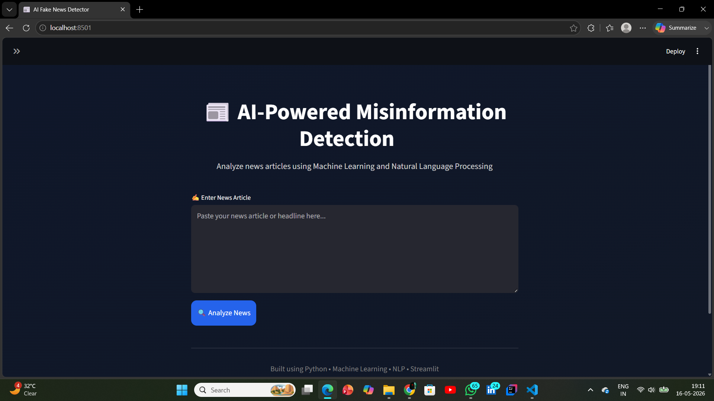
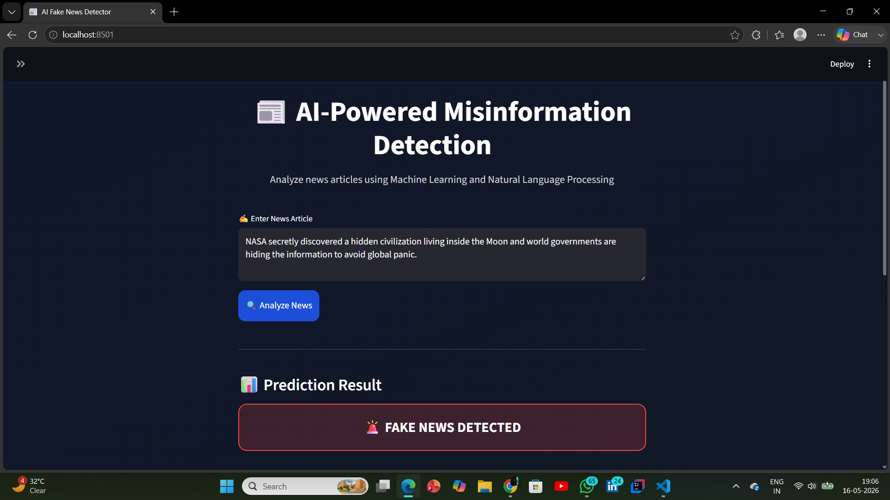
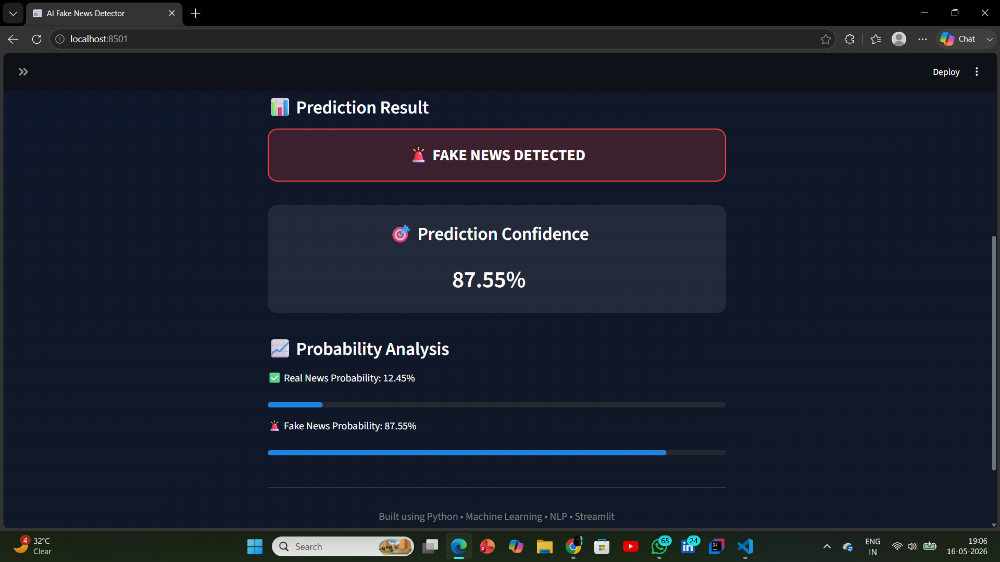
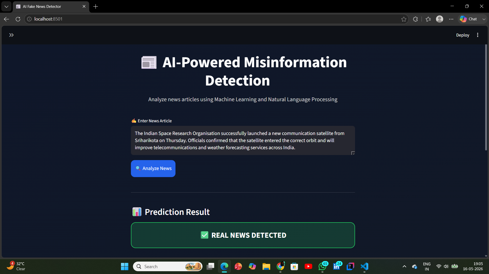
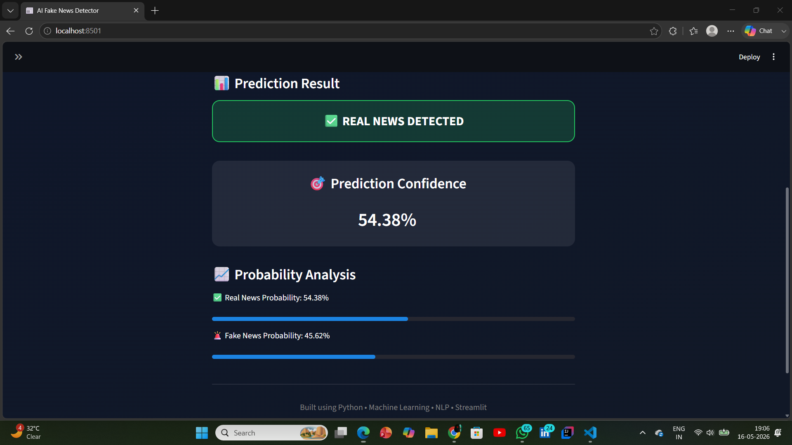
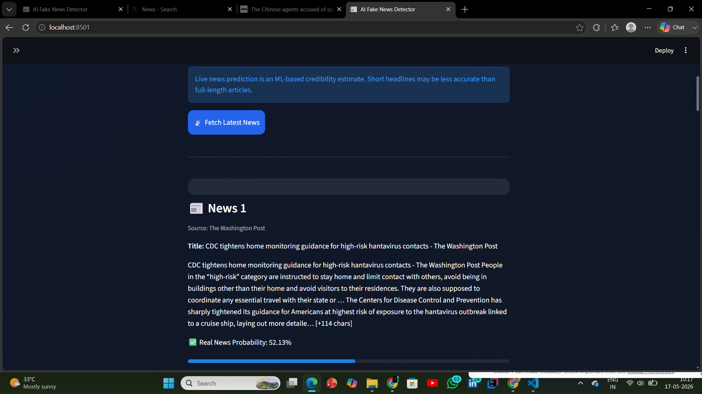
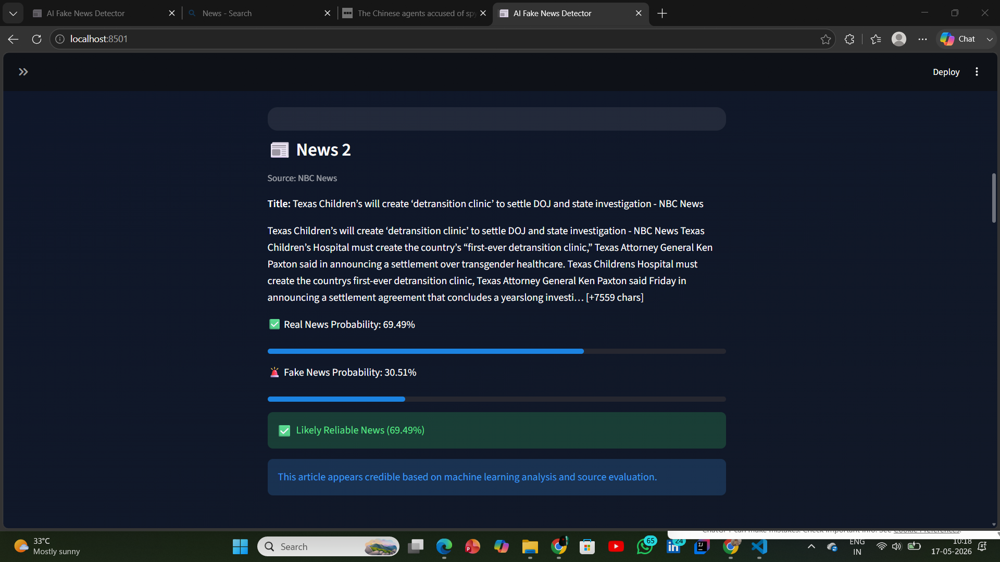

# 📰 AI-Powered Misinformation Detection System

An end-to-end Machine Learning and NLP-based web application that detects whether a news article is likely reliable or potentially suspicious using text analysis, TF-IDF vectorization, and Logistic Regression.

The system also supports real-time live news analysis using NewsAPI integration and provides prediction confidence scores through an interactive Streamlit interface.

---

## 🚀 Live Demo

🔗 Streamlit App:  
https://misinformation-detection-system-phea3g7eenttlvjzqwcdkt.streamlit.app/

---

## 📌 Features

- ✅ Fake vs Real news classification
- ✅ NLP-based text preprocessing
- ✅ TF-IDF feature extraction
- ✅ Logistic Regression classification model
- ✅ Real-time news analysis using NewsAPI
- ✅ Confidence score and probability analysis
- ✅ Interactive Streamlit UI
- ✅ Source-aware credibility calibration
- ✅ Model evaluation report generation
- ✅ Deployed cloud-based application

---

## 🛠️ Tech Stack

### Programming Language
- Python

### Machine Learning & NLP
- Scikit-learn
- NLTK
- TF-IDF Vectorization
- Logistic Regression

### Web Application
- Streamlit

### API Integration
- NewsAPI

### Version Control & Deployment
- Git
- GitHub
- Streamlit Cloud

---

## 🧠 Machine Learning Pipeline

1. Data Collection using benchmark fake-news datasets
2. Text preprocessing
   - Lowercasing
   - Regex cleaning
   - Stopword removal
   - Porter stemming
3. TF-IDF feature extraction
4. Model training using Logistic Regression
5. Prediction probability analysis
6. Real-time inference and live news evaluation

---

## 📊 Model Performance

- Achieved approximately **94% accuracy**
- Evaluated using:
  - Accuracy Score
  - Precision
  - Recall
  - F1-Score
  - Confusion Matrix

---

## 📂 Project Structure

```bash
Misinformation-Detection-System/
│
├── app.py
├── main.py
├── requirements.txt
├── README.md
│
├── dataset/
│   ├── Fake.csv
│   └── True.csv
│
├── models/
│   ├── model.pkl
│   └── vectorizer.pkl
│
└── reports/
    └── evaluation_report.txt
```

---

## ⚙️ Installation & Setup

### Clone Repository

```bash
git clone https://github.com/Prince-Kumar-Saw/Misinformation-Detection-System.git
```

### Move into Project Folder

```bash
cd Misinformation-Detection-System
```

### Install Dependencies

```bash
pip install -r requirements.txt
```

### Train the Model

```bash
python main.py
```

### Run Streamlit App

```bash
streamlit run app.py
```

---

## 📡 Live News Analysis

The application integrates with NewsAPI to fetch real-time headlines and analyze them using the trained ML model.

Since live headlines are shorter than full-length training articles, the system performs source-aware credibility calibration for reputed publishers.

---

# 📷 Application Screenshots

## 🏠 Home Interface



---

## 🚨 Fake News Detection





---

## ✅ Real News Detection





---

## 📰 Live News Analysis





---

## 🎯 Future Improvements

- Deep Learning-based NLP models
- Transformer/BERT integration
- Fake news explainability visualization
- Multi-language news support
- User authentication system
- News source credibility ranking

---

## 👨‍💻 Developed By

Prince Kumar Saw

---

## 📄 License

This project is for educational and learning purposes.